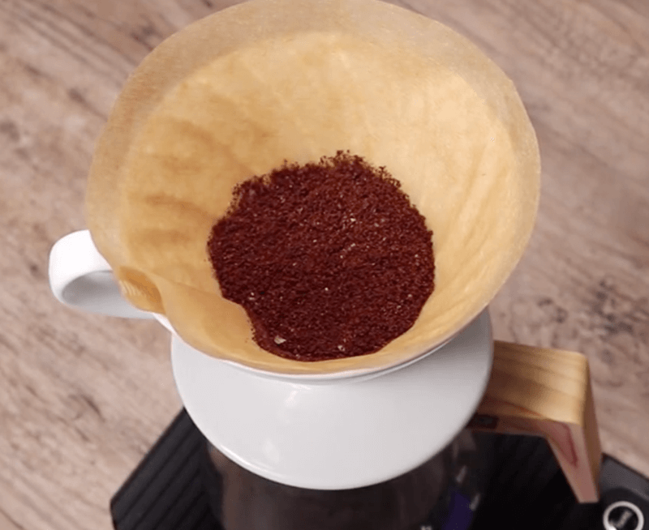

# 手冲咖啡指南  

好几年前，有一次我的前老板去巴厘岛旅游，回来也给我们带了一些咖啡豆粉，我和小伙伴们没见过这东西，拿过来往热水里一泡，搅啊搅，惊讶的发现，这个咖啡竟然不溶，喝一口，不禁感慨，原来真正的咖啡是如此难喝的 ……  

好吧，我一直就是这么个土鳖，土鳖的我只能有土鳖的思考，觉得你们可能会需要一个“使用指南”，这篇教程是我参考了 n 个视频与文档后写出来的。  

为什么选择咖啡豆粉呢？  

起初，我问售货老板，“老板，咖啡豆粉太麻烦了，这儿有速溶咖啡卖吗？”  
老板说，“我们这里不卖速溶咖啡的”。  
……  
我不死心地问“真的没有速溶类型的吗？”  
老板“语重心长”地说，“你是个有品位的人” ……  
老板，你真懂我，我买 ……  

当你收到快递的时候，你会发现，我还寄到了几样东西。  
我想啊，如果我只寄了咖啡豆粉，结果你为了喝上一杯咖啡，还要自己买这样那样的工具，我知道，那感觉挺烦的，所以我把必要的东西都备好了，等你收到了，你马上就可以制作了，那我们开始吧~  

### 咖啡粉  

这种咖啡的名字叫“黄金公豆咖啡”，它的特点是  

-产量比较少  
-咖啡因比较低  
-口感相较其它种类不酸  

### 量  

一般教程上都会说，XX g 咖啡粉比 XX g 水，老实说，土鳖的我懒得去量，发几组图让你感受下，心底里就有个大概了。  

第一组：  

  
  

第二组：  

  
  
  

第三组：  

  
  

### 准备  

我们采用的是“手冲”制作咖啡方法  

工具：滤纸、滤杯、小杯子（喝咖啡）、可以支撑滤杯的大容器（装过滤出来的咖啡）、开水  

### 步骤  

1.把滤杯放在大杯子上方  

可能你会找不到杯口大小刚好可以支撑滤杯的容器，像我自己的话，找了两根筷子架在大容器上，就可以把滤杯稳稳地放在上面了。  

2.折一下滤纸有凹凸的一边，然后打开放在滤杯上  

  

3.往滤纸上均匀地加入开水，必要的时候，用勺子压一压，让滤纸紧贴杯壁，随后倒掉杯中过滤出来的开水  

我觉得这一步有几个作用：清洗、给滤杯加温、让滤纸紧贴杯壁  

4.开始冲泡过滤  

1）（记得先把上一步过滤出来的开水倒掉）往滤杯中加入“适量”咖啡粉，抖平，加少量开水  

（加入开水速度不要太快，最好用细口的水壶加入）  

加开水的方法是，从粉末的中心开始画圈，逐渐向四周画越来越大的圈。  

作为参考可以画到一元硬币大小，实际上，这一步是为了湿润所有咖啡粉。  

2）等待漫长的 30 秒左右  

3）反复画圈慢慢加入开水，直到结束。  

这个过程中，有人什么都不做，有人会用勺子去搅拌咖啡粉，也有人把整个杯子拿起来晃动（转圈）

5.加入备好的椰子糖 Coconut Sugar 与椰子奶油 Coconut Creamer

糖很好溶，
椰子奶油（白色）倒入后会在水面上成一堆，我试过倒在咖啡中后用勺子往粉末中间一压，结果很多凝成一块。

我也试过，搅拌粉末周围的咖啡，不去碰奶油粉，结果它慢慢溶解得很不错。

另外，因为过滤出来的咖啡温度可能不会太高了，我会再给它加加热。

6.搅一搅，喝，嗯 …… 不不不，吐出来，拍个照先~

### 视频  

我在网上找了两个教程：  

比较中规中矩（较长、完整操作过程、视频略乏味）：  
https://haokan.baidu.com/v?vid=8738247175309164304&pd=bjh&fr=bjhauthor&type=video  

这个听起来舒服些（简短、帅哥、好听）：  
https://haokan.baidu.com/v?vid=13263994974701684511&pd=bjh&fr=bjhauthor&type=video  

### 温馨提示  

本教程旨在，如果你未曾自己冲过咖啡，它能让你在尽量短的时间里面喝上一杯。可如果你追求更优雅的喝法、更极致的味道 …… 千万要去找一位好老师~  

### 结束  

这篇教程，其实是在我旅游途中准备礼物的时候就开始构思了，最终还有有点犯懒，直到礼物开始寄出的时候，我才开始着手整理书写。  

不过，我并不嫌麻烦，反而，我想，有些人，能够让你发自内心地有动力去做好某些事儿，感觉真好。  

希望你会很享受自己亲手制作出来的咖啡。  

2020.2.20  
谢嘉锋