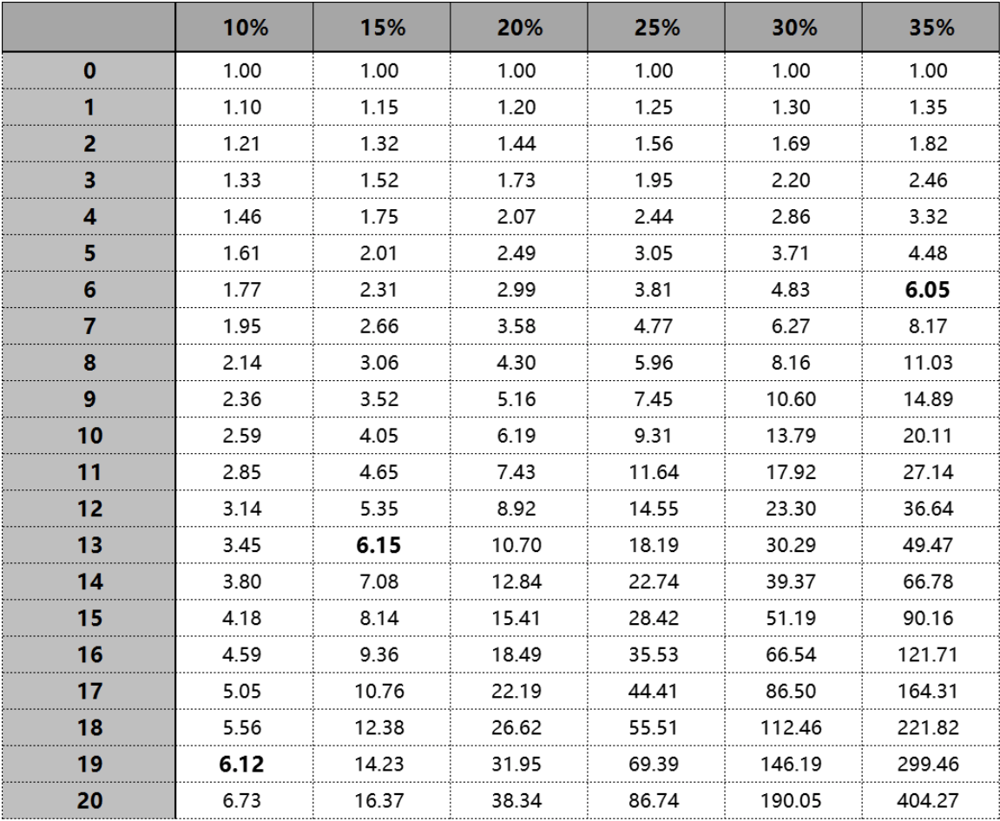
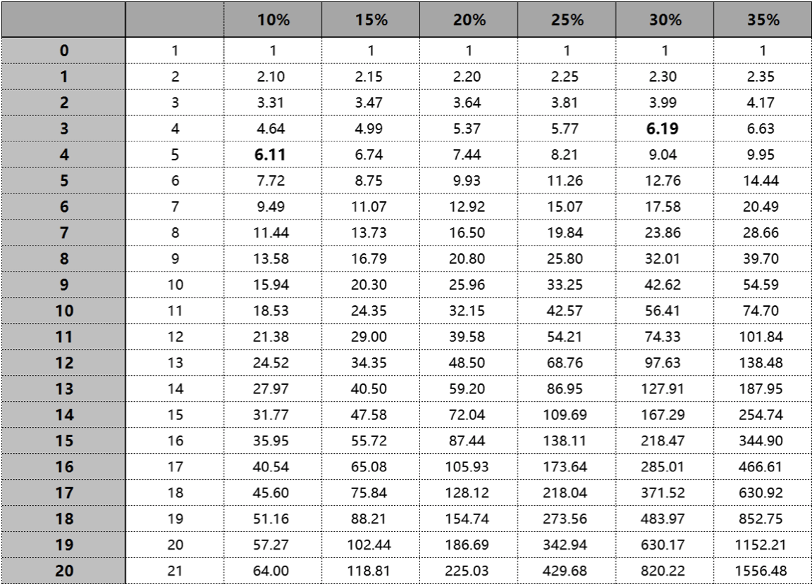
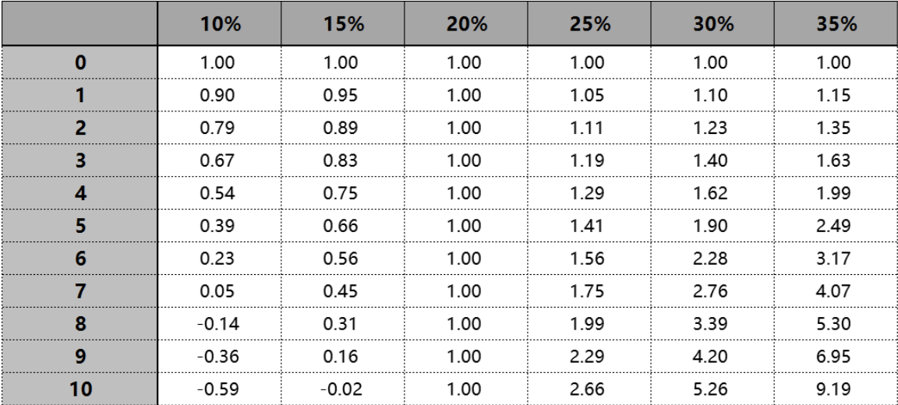

原文：《长期究竟是多长？》2017-2-20  

<hr>

```  
自我评价：(1~5)  
对原本的喜欢程度：4  
对笔记思考的喜欢程度：3  
对读者来说可读性如何：2  
``` 

<hr>  

一、文章概要  

（文中的图片取自《通往财富自由之路》原文）  

1.第一个表格：  
  
可以得到一个事实：“长期”很可能对不同的人来说长度是不一样的。  
一个比较直接的结论是：你越弱，你的长期越长 ……  
翻译一下：你竟然可以通过提升能力缩短长期的长度！  

还有更狠的翻译：学习使人拥有更高质量的长寿 …… 他们在长期过去之后，相对于别人有着更长的“自由”时限。  

2.如果我们加入“定投策略”：  
  
这这个图中可以看到，10%与30%的年化复合收益率第三、四年的时候看起来差异不大，可以用来说明：在一定程度上，策略可以弥补能力上的不足。  

策略的力量非常强大，10%的符合年化收益率，在第一张图要等到19年才能做到6.12，第二张图第四年就能做到6.11。（尽管第二张图的投入多了4个单位，可那也是贯彻执行策略的结果）  

到这里应该看到投资的重要秘密之一：你最好有除了投资以外的稳定收入来源。  

3.如果每年都会拿一部分收益出来花掉：  
  
在这个图里，就算有能力做到35%符合年化收益，翻倍也需要至少4年，坚持10年也才9.19 ……  

4.总结：  
1）对于能力越强的人来说，“长期”越短；  
2）对于使用正确策略的人来说，“长期”更短；  
3）对有能力在投资之外赚钱的人来说，“长期”更短。  

5.有个可以计算长期的“72法则”：  
x ≌ 72 / 年化复合收益率值 （得到的结果为翻倍所需要的年限）  
你可以这么理解：  
1）能让你的投资翻倍的时间，相当于中期；  
2）能让你的投资翻倍再翻倍的时间，相当于长期；  

6.再多叮嘱一句：  
你越年轻，就越觉得“长期”越长……  

除了因为不同年龄阶段的人对于时间的感知不同。  
在投资领域里，时间对于几乎所有人还有另外一种感觉：  
你越年轻，欲望越多也越强烈 ……  
年轻的时候有太多（事后可能会觉得不必要的）花钱的欲望和需求，这使得那“长期”感觉上更为难熬 —— 可问题在于，那只是“感觉”，而不是事实，除非你自己选择把那感觉活成事实。  

更重要的在于，越是年轻的时候，投资所需要的特定思考能力越差，乃至于那个“长期”感觉更长！  

<hr>  

二、特别喜欢的句子  

1.这世上只有很少的人愿意通过自己的“深入”思考提高自己的选择或者行动的质量。  

2.年轻的时候有太多（事后可能会觉得不必要的）花钱的欲望和需求，这使得那“长期”感觉上更为难熬 —— 可问题在于，那只是“感觉”，而不是事实，除非你自己选择把那感觉活成事实。  

<hr>  

三、个人思考  

不管是“不同的复利增长速度，长期来看会产生天差地别的结果”也好，还是“不同的增长速度达到某一个‘长期’所需要的时间不同”也罢。  

本质上来看只不过是“对于同一个现象的不同角度朴素观察”。  

我想，当我们在本文章中看到第二种说法的时候，内心所感受到的震撼感，可能并没有那么重要，就好像，我猜你跟我一样在第一次听说前一种说法的时候也是内心激动不已 ……  

可我们真的从那时候起深刻地改变了吗？  

很可能并没有一开始所期盼的那么“自然而然”、“能量巨大” ……  

首先，我们几乎没有办法确定(顶多只不过是选择相信)什么对于自身来说才是百分百成长率更高的方式，以及那成长率究竟是多少，就算自己真的做着成长率更快的事儿，那天差地别的结果真若出现也是理论上的许多年之后才能明显体会的事儿，而在最初的相当长时间里就是难以体会观察得到；  

更为重要的是，在这种情况下，我们对于“长期”的感知是更容易“糊里糊涂”的：“我知道最终会有差异，不知道是十年，还是二十年、三十年，反正是挺长的一段时间” ……  

而，你是否也体会到了，仔细看第二个角度，我们的内心感受是不一样的，那个“长期”更清晰、确定了(尽管依然无法确定)：“如果在未来，有某一个高点是我们能够达到的，现在的自己确实可以通过挣扎着让自己更早走到那高点 ……”  

要说到底有什么不同，我猜，那是因为，我们在调用第一种思考的时候，会不自觉的去跟别人比较，这注定是“出路”不多，可，当我们调用第二种思考的时候，我们会自然而然地去对比自己，原来二十年才能做到的事儿，我们确实有机会通过不断升级自己工作方式结果十年就完成了。  

这里倒不是说，与自己比就是对的，与别人比就是错的。  
我是这样想的，道理、概念无论多好，能够对自己产生深刻影响才有意义，有时候，我们不断反思、打磨某一个事儿，也“只不过”是为了理解上的那点小差异，却实际上差异巨大。  

所谓的“概念升级”，不就是这么一回事儿吗~  

2019.4.24  
