### 核心思考

老实说，从现在的角度往回看，最初的时候我真的不知道自己想要做的是什么样的东西 ……  
我只是感觉，强烈地感觉，我能够做出来点东西 ……  

我花了一周多的时间做出来这个小工具：

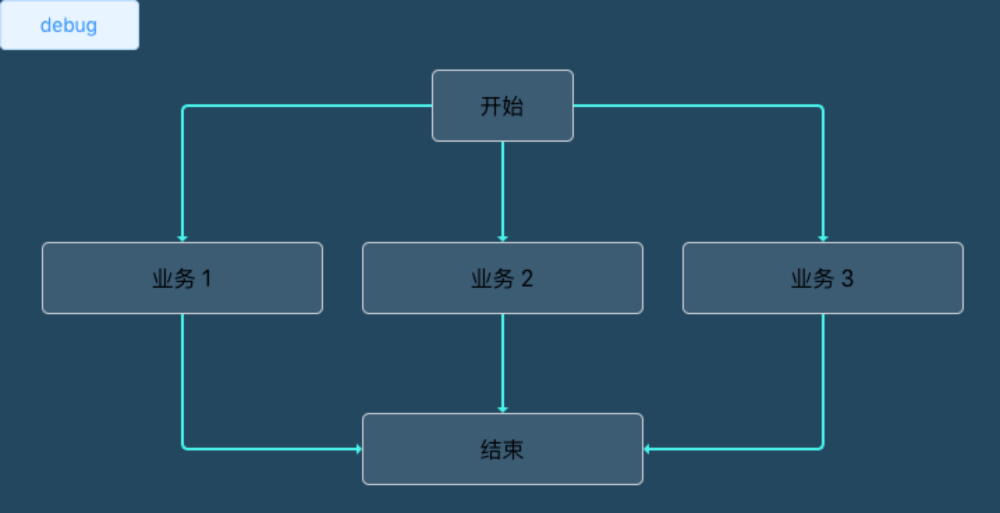

所以，我得到的是一个什么样的东西呢？(一本正经地下个定义 …… )

> 从前端工程师的角度，它是一个以相对简洁直观的方式，输入相对少的信息量，又能够相对靠谱地适配大部分常规需求场景的网页流程图绘画工具

#### 求索

从使用者的角度，我想，判断一个东西是否足够有价值少不了考虑这两个维度：是否足够简洁？是否足够便利？
又因为当前工具的目标用户是前端工程师，所以在便利性方面可以做少许妥协 —— 即，简化工程师向机器传达思想的环节才是关键 ……  

写这么一个工具，有不同于写一个常用的 table 组件的地方，因为 table 组件的“最少必要信息量”总是相对容易确定: 它需要一个表头，以及每个表头所对应的每一行的值以及其它属性

然而，绘画一个流程图的“最少必要信息量”是什么呢？一时间我想不明白。

在网络上做检索的过程中，我吸收了一些别人的思考：

##### 1.chart1 - canvas

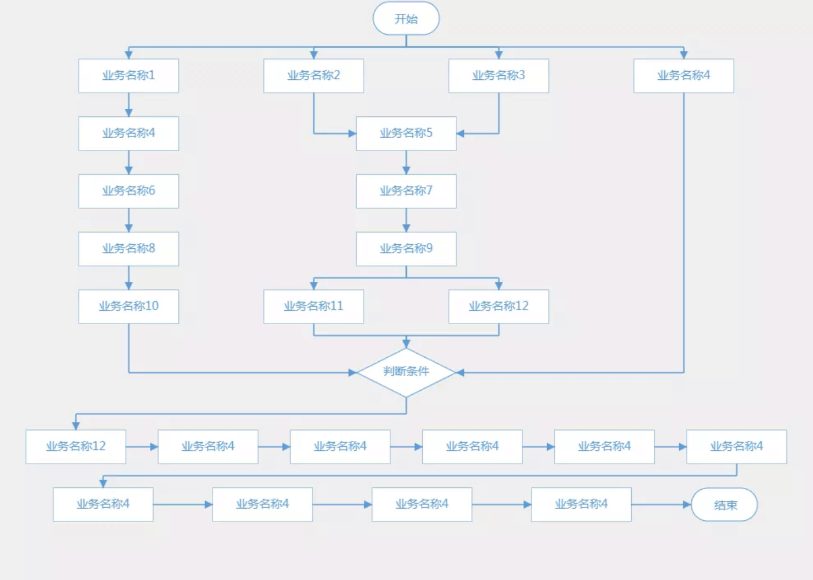
(因为中文网页的抄袭版本太多，我搞不清楚作者是哪一位)

在这个例子中，我们可以直接告诉程序，这个节点放在哪里（行和列），以及线条应该从哪里开始？如何走？又走到哪里？

```js
// one step's info
{
    type:'Step',
    text:'业务名称2',
    name:'step_2_2', // origin
    arrowArr:[
        {
            arrow:'drawBottomToLeft', // how to go 
            to:'step_3_2' // where to go 
        }
    ]
},
```

##### chart2 - flowChart.js

官网：https://github.com/adrai/flowchart.js

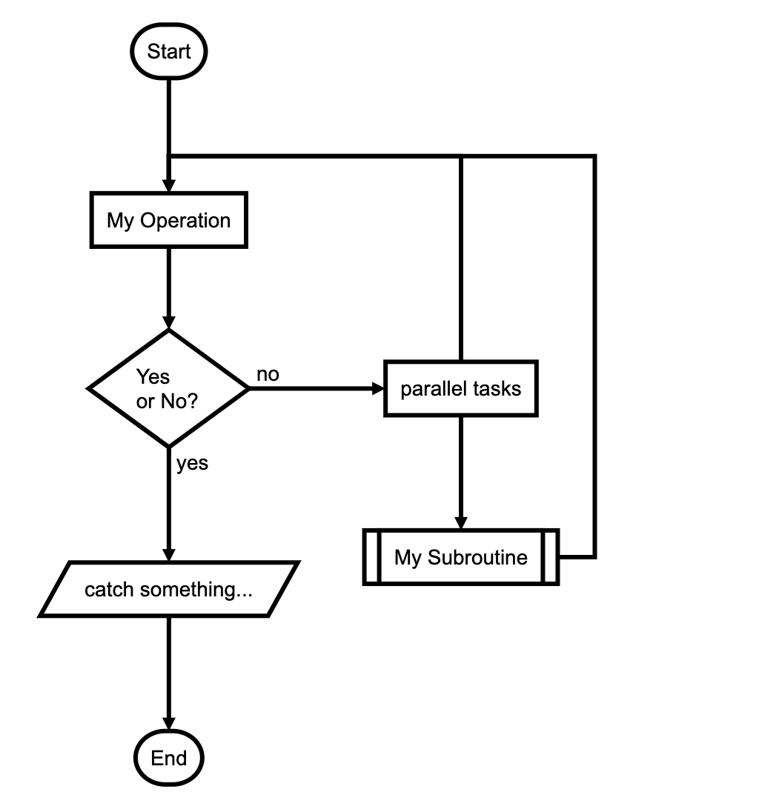

```js
// define every step
// &
// steps chain
const template = `
st=>start: Start|past:>http://www.google.com[blank]
e=>end: End:>http://www.google.com
op1=>operation: My Operation|past:$myFunction
op2=>operation: Stuff|current

st->op1(right)->cond
cond(yes, right)->c2
`
```

第二个例子看起来会简便一些，定义节点和线条所需要的信息量会少很多，大部分设置是在基本配置里面统一完成的

##### 3.chart3 - css

以上两个流程图都是通过 canvas 实现的，当然还有 css 实现的：

源码：https://codepen.io/demonwhite/pen/Gxqpzv

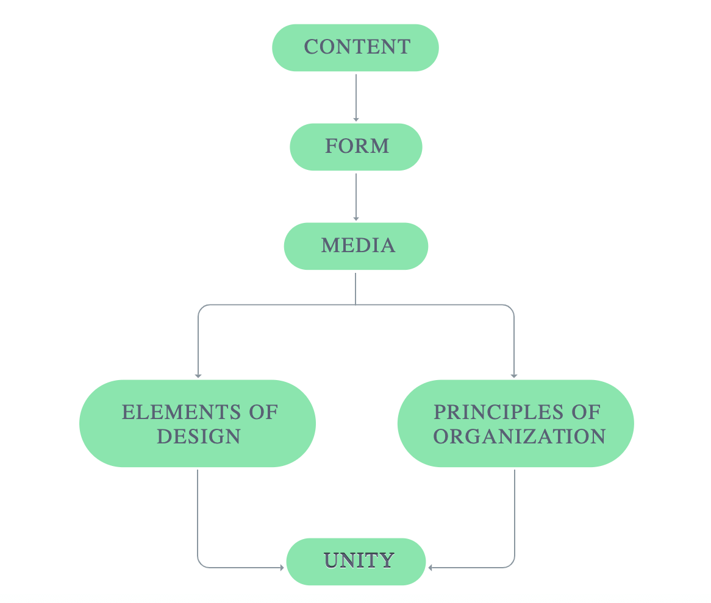

这是一个纯 css 绘画的流程图，相比前面两者，实现的难度会大一些，但是一旦实现了，想要进一步给节点添加效果却非常方便。

#### 结果

在本次求索的过程中，我渐渐得到了自己的思考：

首先，我需要一些前提条件：

>1.不管节点（即“步骤”，下同）的大小如何，它所占据的区域是固定的
>
>2.不追求适配所有情况，只满足最基本的绘画需求
>
>3.允许程序完成大部分绘画，然后由前端工程师手动微调

那么，画一个流程图的“最少必要信息量”可以是

> 1.基本参数：节点默认宽高、节点之间的间隔
> 
> 2.节点的内容、类型、自定义属性（宽高）；
> 
> 3.节点的位置（处于第几行、第几列）；
> 
> 4.线条连接哪两个节点，以及线条的走向


落实到代码层面是这样的：

1. 节点配置

```js
const stepsOptions = [
    [{ content: '步骤 1', width: 100 }],
    [{ content: '步骤 2', }],
    [{ content: '步骤 3-1', width: 100 }, { content: '步骤 3-2', }, { content: '步骤 3-3', width: 100 }], // 第四行
    [{}, { content: '通过', }, { content: ' 不通过', }],
    [{ content: '结束', }],
]
```

比如，第四行代码的意思是说：流程图第三行有三个节点，以及每个节点的内容

2. 线条模板

```js
const linesTemplate = `
1_1-(down)->2_1-(downLeftDown)-z>3_1-(downRightDown)-z>4_2-(right)->4_3-(rightUpLeft)-c>1_1
4_3-(downLeft)->5_1
2_1-(downRightDown)-z>3_3
3_2-(down)->4_1
3_3-(left)->3_2
4_1-(down)->5_1`
```

比如，第二行代码的意思是，第四行第三个节点与第五行第一个节点，这两个两个节点之间，以‘右-下’的走向绘画一根线条

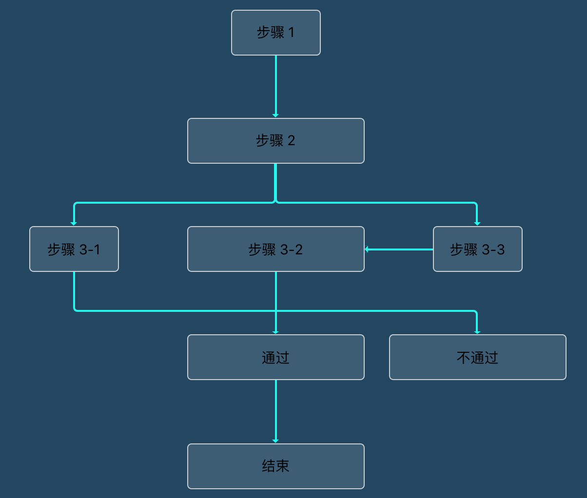

你可能会发现，利用这样的写法，实际上需要传入的信息量比上面提到的 flowChart.js 第三方代码更多一些 ……  

我是这么考虑的：

不应该在实用性维度上做过分的让步，在我使用 flowCart.js 的过程中，我发现它极度便利，但是与此同时，它在样式自定义方面上又薄弱到了极点 —— 它可以非常自动地计算出线条的合适走向，与之相应的不得不做出的牺牲就是，我们很难去干预线条的走向；甚至我们只能在非常小的程度上改动它的节点样式 ……  

以上，

确定了传入的信息量，接下来就是给计算器编码一套“规则”，让它生产出来我们想要的东西。

### 实现的思路

#### 关于节点与线条的定位

在这里，定位的核心是采用 css 的 `position` ，首先写一个 div，定一下宽高，设置 `position: relative;`。然后给所有 steps, lines 设置 `position: absolute;`，丢进去。

结果就是，所谓的“定位”问题，实际上就变成了数学计算问题，计算每一个 step 或 line 出现的位置、宽高（关键是起点坐标(x, y)的计算）

##### 画节点

1.通过每一行的步骤数，以及每个步骤对应的 index，结合 step 的 width, 以 x = 0 未中心做定位

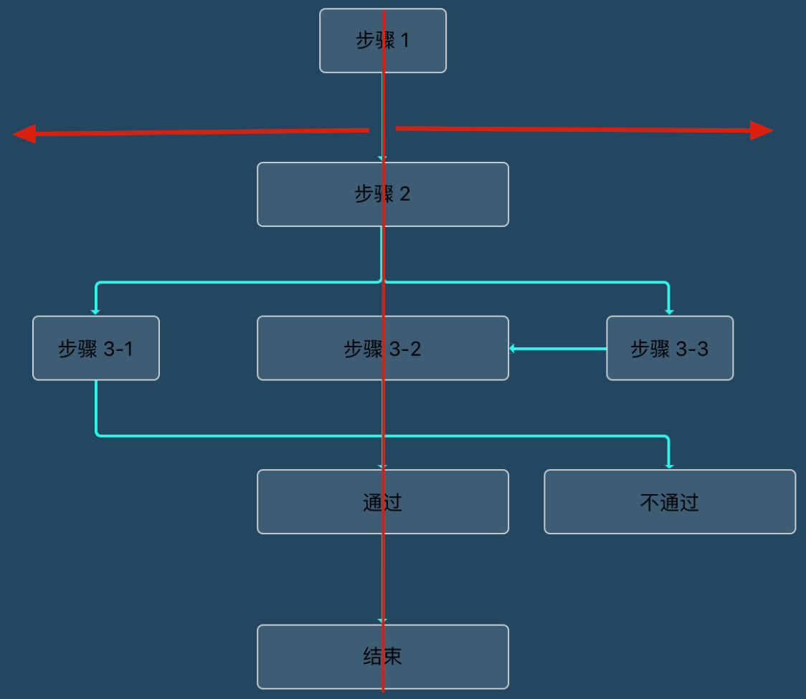

2.利用黄金分割比，优雅地计算出每一行距离顶端的高度 …… 

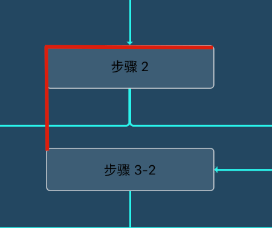

##### 画线条

css 中的线条没有我们想想中的那么好绘画，借鉴了上文提到的 chart3，我采用 border 来绘画线条

普通线条的或者有一个拐点的线条没有特别的地方，主要是根据线条的走向然后利用 `border-radius` 让拐点变得圆滑

```scss
.line {
    &.downRight, &.leftUp {
        border-radius: 0 0 0 5px;
        border-left: $borderStyle;
        border-bottom: $borderStyle;
    }
}
```

然而需要拐弯两次的 z 形线和 c 形线就需要一点小技巧

在 z-形线条的实现上，我直接取用中间黄金分割点，拆分成两个 div:

z-线条（1）
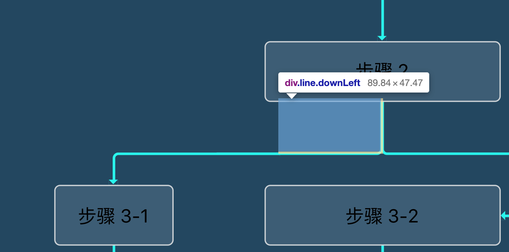

z-线条（2）
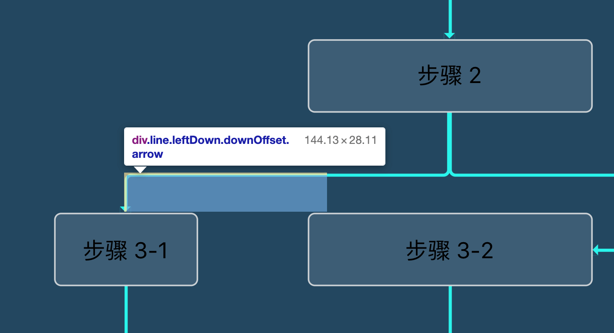

c-形线条的难点在于，在确定了起止点之后，它还需要绕一个大弯，关键点就在于，线条既不能横穿其它节点，又能够自动在合适的地方转弯。
这里的实现是这样的，拿左边部分的拐弯来说，先找出起止节点之间的所有行中最宽的一行，以这一行的最左作为起点，找出这一点与图形左边缘之间靠近节点的黄金分割点，作为我们 C 形线条的中转站 ……  

黄金分割点的好处是 —— “效果总不会差”

c-线条（1）
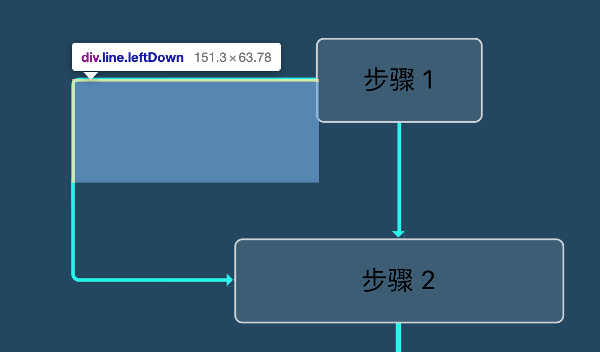

c-线条（2）
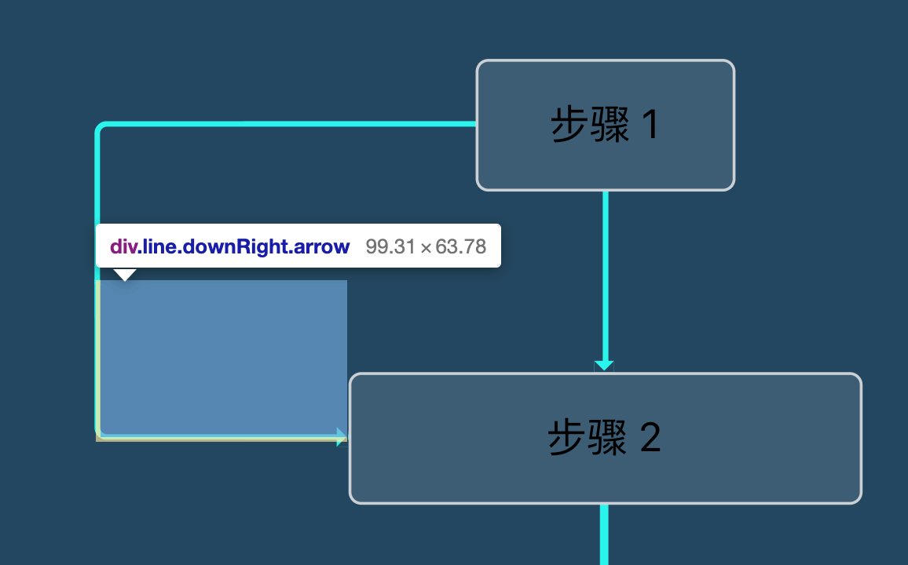


##### 画箭头

最初的思路是，让箭头也独立出来，计算它在页面上的定位，然后把它放进去，结果发现，想要让它刚刚好出现在线条与边框交错的位置，理论上可行，可现实上会比较麻烦，而且效果非常脆弱，容易出现样式 bug。

于是我把它做成了线条 div 的一个伪类，根据线条的方向可以确定它出现的位置和方位：

```scss
&.downRight {
    // .arrow 用来判断需不需要画箭头
    // ::after 实现箭头效果
    &.arrow::after {
        right: -$lineWidth;
        @include arrowBottomOffset;
        @include arrowRight;
    }
}
```

### 一些思考

#### 优点

1. 简洁直观的模板语法

1）节点属性

根据节点在数据中的位置信息（第 i 个数组中的第 j 项），把节点映射到页面上的位置（第 i 行第 j 排）

2）线条语法：

1_1-(downLeft)->2_1

相对简洁直观地表示起止节点以及线条的走向，开发者不用做任何数值计算就可以自动画出一条符合大致预期的线条

2. 样式相对灵活，使用门槛相对低

与常规的流程图绘画（普遍 canvas 用得多）不同，这个工具采用的是 css 实现，所以想要对流程图结构进行调整（比如修改样式、添加样式效果），实操起来会更为友好一些

从另外一个角度上考虑，大部分前端实际上是相对 canvas 更熟悉 css 的 ……  

这个工具还提供了一个不错的定位功能，可以快速定位到某一个步骤或线条所对应的 div 数据

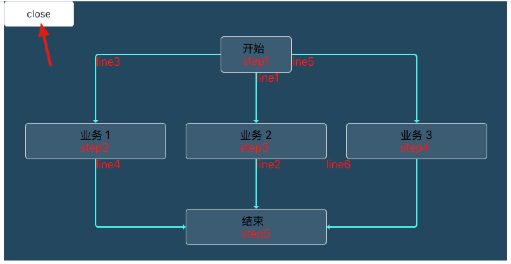

#### 不足

1. 报错机制

目前 line / cline / zline 容易写错，还没提供有效的错误识别

2. 半自动

目前这个小工具只能做到半自动，比如需要手动补充 vue 文件结构，引入 css, 并对 css 基本数据进行调整

#### 一些思绪

复杂并不意味着更优，最初在构思 Z, C 形线条的实现的时候，考虑到许多特殊情况，比如，如何让 Z 线条不穿过别人呢？如果我的 C 线条不想在外面拐弯，我想在某两个步骤之间的缝隙穿过呢？

也就是说，最初我想要做的是兼容各种奇奇怪怪的画线兼容情况，考虑得太复杂，实现太难，以至于，思考老是进入死胡同。

直到，某一刻恍然大悟：我干嘛要追求面面俱到，我只要处理好最常规最简单的情况就行了吧，一时间，前途似乎敞开了 ……  

谢嘉锋 ---- 2020-06-20 19:33:58